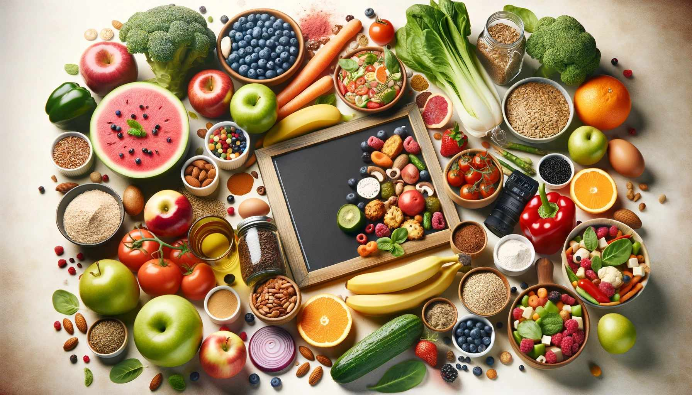
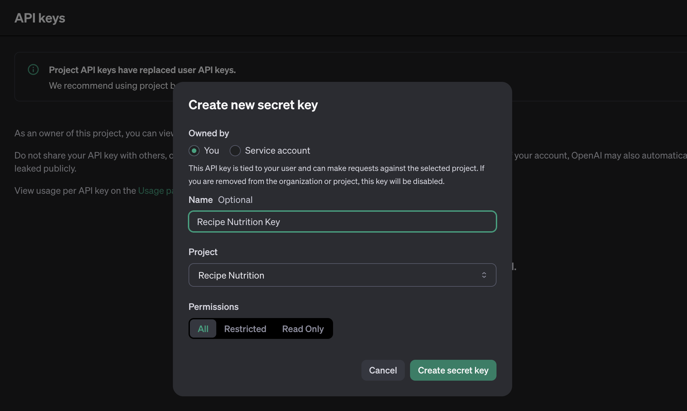
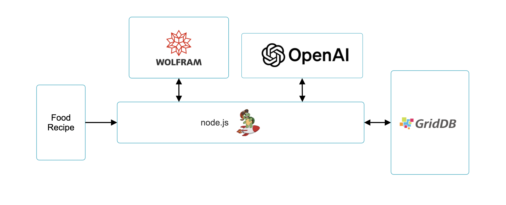
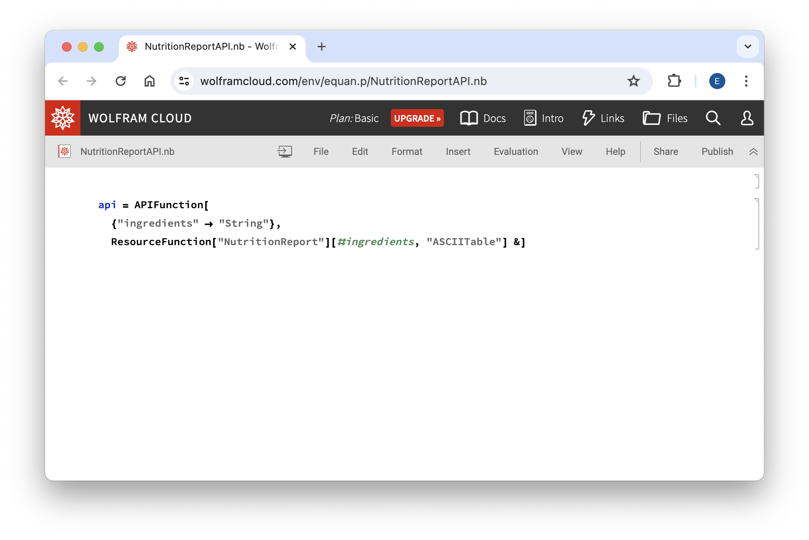
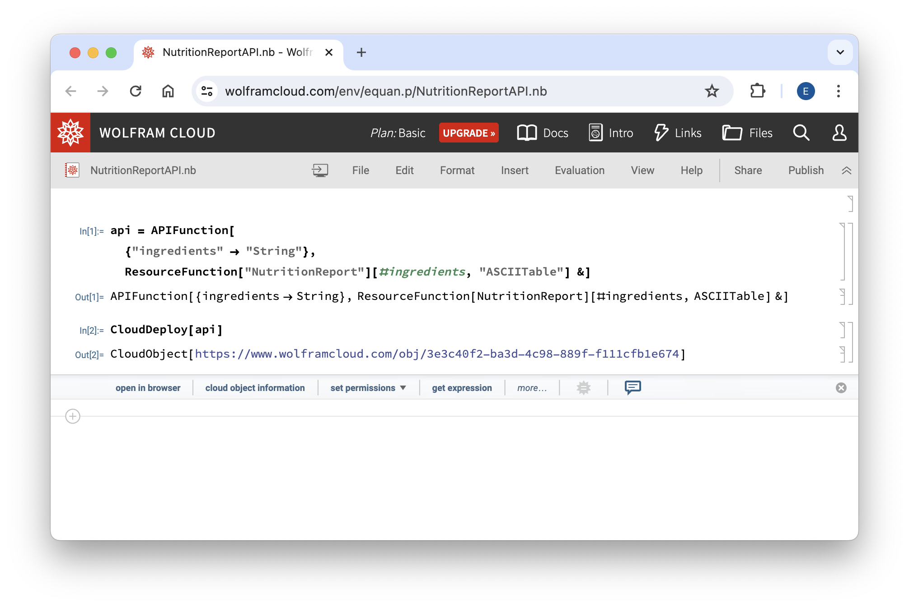

# Recipe Nutrition Analysis Using Wolfram and AI



In this tutorial, you will learn how to analyze recipe nutrition using Wolfram Cloud and OpenAI on the Node.js platform. The recipe and the report analysis will be saved to the GridDB database.

## Table of Contents

1. [Introduction](#introduction)
2. [Running the Project](#running-the-project)
3. [Getting Started](#getting-started)

    3.1 [Setting Up Wolfram Cloud Account](#1-setting-up-wolfram-cloud-account)

    3.2 [Installing Node.js](#2-installing-nodejs)

    3.3 [Setting Up GridDB](#3-setting-up-griddb)

    3.4 [Configuring OpenAI](#4-configuring-openai)
4. [Project Structure](#project-structure)
5. [How it Works?](#how-it-works)

    5.1 [Connecting to Wolfram Cloud](#connecting-to-wolfram-cloud)

    5.2 [Retrieving Recipe Data](#retrieving-recipe-data)

    5.3 [Analyzing Nutrition Data](#analyzing-nutrition-data)

    5.4 [Node.js Server](#nodejs-server)

    5.5 [Storing Data in GridDB](#storing-data-in-griddb)
7. [Conclusion](#conclusion)

## Introduction

This tutorial will walk you through building a nutrition analysis tool for recipes using Wolfram Cloud and OpenAI. We will use Node.js for the backend and store the resulting data in GridDB.

## Running the Project

Clone the project from this [GitHub](https://github.com/junwatu/recipe-nutritional-analysis.git) repository.

```shell
git clone https://github.com/junwatu/recipe-nutritional-analysis.git
```

Change the directory to the project root and go to the `app` folder then install all the dependencies:

```shell
cd recipe-nutritional-analysis
cd app
npm install
```

Create the `.env` file and copy environment variables from the `.env.example`. There are three environment variables:

```ini
OPENAI_API_KEY=
VITE_APP_URL=http://localhost:4000
WOLFRAM_CLOUD_API=https://www.wolframcloud.com/obj/4a0af00b-e14e-4467-b292-6d0ca161ff65
```

You need an [OpenAI API](#configuring-openai) key for this project, please go [here](#4-configuring-openai) for the explanation.

## Getting Started

To build this project, you need the following steps:

### 1. Setting Up Wolfram Cloud Account

[Sign up](https://www.wolframcloud.com) for the Wolfram Cloud account. You will need it later to create a service for recipe nutrition calculation.

### 2. Installing Node.js

This project will run on the Node.js platform. You need to install it from [here](https://nodejs.org/en/download). For this project, we will use the `nvm` package manager and Node.js v16.20.2
LTS version.

```shell
# installs nvm (Node Version Manager)
curl -o- https://raw.githubusercontent.com/nvm-sh/nvm/v0.39.7/install.sh | bash

# download and install Node.js
nvm install 16

# verifies the right Node.js version is in the environment
node -v # should print `v16.20.2`

# verifies the right NPM version is in the environment
npm -v # should print `8.19.4``
```

To connect Node.js and GridDB database, you need the [gridb-node-api](https://github.com/nodejs/node-addon-api) npm package which is a Node.js binding developed using GridDB C Client and Node addon API.

### 3. Setting Up GridDB

We will use the GridDB database to save recipes and it's nutrition analysis. Please look at the [guide](https://docs.griddb.net/latest/gettingstarted/using-apt/#install-with-apt-get) for detailed installation. We will use Ubuntu 20.04 LTS here.

Run GridDB and check if the service is running. Use this command:

```shell
sudo systemctl status gridstore
```

If not running try to run the database with this command:

```shell
sudo systemctl start gridstore
```

### 4. Configuring OpenAI

To access any OpenAI services, you need a valid key. Go to this [link](https://platform.openai.com/api-keys) and create a new OpenAI key.



The OpenAI key is on a project basis, so we need to create a project first in the OpenAI platform and you need also to enable any models that you use on a project. For this project, we will need `gpt-4o` model.


The OpenAI key will be saved on the `.env` file and make sure not to include it in version control by adding it to the `.gitignore`.

## Project Structure

This project uses Vite for the development tools, React for the user interface, and Node.js as the server. The directory and file structure for this project:

```shell
recipe-nutrition-analysis/app/
├── public/
│   └── (assets and compiled files)
├── src/
│   ├── App.jsx
│   └── main.jsx
├── .env
├── .env.example
├── index.html
├── package.json
├── server.js
├── README.md
└── vite.config.js
```

## How it Works?

This system is designed to perform nutrition analysis on food recipes by integrating various services for efficient data processing and management. It uses Node.js as the central server to coordinate tasks between different components including Wolfram for computations, OpenAI for natural language processing, and GridDB for data storage.



### Connecting to Wolfram Cloud

The simplest way to use any Wolfram function is by consuming it using an API call. These are the general steps to deploy a function written in Wolfram language so it can be used as an API.

1. Create a new [notebook](https://reference.wolfram.com/language/guide/NotebookBasics.html) in Wolfram Cloud.
2. Code a function to analyze recipe nutrition. We will use the [NutritionReport](https://resources.wolframcloud.com/FunctionRepository/resources/NutritionReport) function to calculate the recipe nutrition.
  
   

   To execute or evaluate a function in Wolfram notebook, you can press `shift` + `enter` keys. This is needed to make sure the function is executed correctly before deploying it into production.

3. Deploy the function into an API using the `CloudDeploy` function and after the deployment, you will get an API URL.

   

   You can find the notebook file in the project source code or directly from this [link](https://github.com/junwatu/recipe-nutritional-analysis/blob/main/app/NutritionReportAPI.nb) and then you can upload it to the Wolfram Cloud.

4. Call the API from OpenAI using the [function calling](https://platform.openai.com/docs/guides/function-calling) feature.

### Retrieving Recipe Data

In this project, the recipe data can be pasted or directly typed into the text area and then submitted to the Node.js server (more on this [here](#nodejs-server)). To clean up the recipe data, you can use AI to filter and format the data. In this project, we will use OpenAI to clean the recipe data and format it so the Wolfram function can process it.

In this code, the `agent` function will clean the recipe data and then call the Wolfram function through a function call indicated by the `tool_calls` properties.

```js
export async function agent(foodRecipe) {
    messages.push({
        role: "user",
        content: `Clean up this recipe so the ingredients are arranged line by line. remove any how-to. Shorten any long ingredient description separated by a comma. Answer with the recipe list only.

        Example:

        600 g chicken drumsticks
        2 cloves garlic, (minced)
        1 tsp ginger, (minced)
        1 shallot, finely chopped
        4 tbsp soy sauce
        4 tbsp oyster sauce
        2 tbsp black pepper
        1 tbsp white pepper

        Recipe >\n

        ${foodRecipe}

        \nchange the ingredient name to match with the Wolfram database and use the list of ingredient results for nutrition analysis.`,
    });

    const response = await openai.chat.completions.create({
        model: "gpt-4o",
        messages: messages,
        tools: tools,
    });

    console.log(response.choices[0].message?.tool_calls[0].function);
    const {
        finish_reason,
        message
    } = response.choices[0];

    if (finish_reason === "tool_calls" && message.tool_calls) {
        const functionName = message.tool_calls[0].function.name;
        const functionToCall = availableTools[functionName];
        const functionArgs = JSON.parse(message.tool_calls[0].function.arguments);
        const functionArgsArr = Object.values(functionArgs);
        const functionResponse = await functionToCall.apply(null, functionArgsArr);

        const readDataByAI = await openai.chat.completions.create({
            model: "gpt-4o",
            messages: [{
                role: 'user',
                content: `Fill the empty data if possible. Create a clean markdown table from this nutrition data. Answer table data only:\n ${functionResponse}\n`
            }]
        })

        console.log(readDataByAI.choices[0].message);
        return readDataByAI.choices[0].message;
    }
}
```

After the Wolfram function does the nutritional analysis, the result will be sent back to the OpenAI for another processing which is formatting the data into a markdown formatted text.

### Analyzing Nutrition Data

To analyze nutrition from the ingredients recipe, as mentioned before, we will use the [NutritionReport](https://resources.wolframcloud.com/FunctionRepository/resources/NutritionReport) function that is already deployed as an API. It's easy to invoke the API using Node.js. 

For example, the `analyzeIngredients` function in the code below will calculate the recipe nutrition based on the `ingredients` parameter:

```js
import axios from 'axios'

export const analyzeIngredients = async (ingredients) => {
    if (!ingredients || !Array.isArray(ingredients)) {
        throw new Error('Invalid ingredients format')
    }

    const params = new URLSearchParams({ ingredients: ingredients.join('\n') }).toString()
    // eslint-disable-next-line no-undef
    const url = `${process.env.WOLFRAM_CLOUD_API}?${params}`

    try {
        const response = await axios.get(url)
        return response.data
    } catch (error) {
        console.error('Error fetching recipe:', error)
        throw new Error('Internal Server Error')
    }
}
```

The function will retrieve the `WOLFRAM_CLOUD_API` environment variable from the `.env` file. In the event of a URL change in the deployed API, you can update the new URL in the `.env` file. This function will also be called from OpenAI through function calling.

```js
const availableTools = {
    analyzeIngredients
};

// remove for clarity

if (finish_reason === "tool_calls" && message.tool_calls) {
        const functionName = message.tool_calls[0].function.name;
        const functionToCall = availableTools[functionName];
        const functionArgs = JSON.parse(message.tool_calls[0].function.arguments);
        const functionArgsArr = Object.values(functionArgs);
        const functionResponse = await functionToCall.apply(null, functionArgsArr);

        // remove for clarity
}
```

Which function to invoke? If there are more than two functions in the `availableTools`, OpenAI will be smart enough to decide when and which function to invoke in the `availableTools` array. 

### Node.js Server

The server code resides in the `server.js` file. It has three main routes:

| Route         | Method | Description                                                                        |
|---------------|--------|------------------------------------------------------------------------------------|
| `/analyze`    | POST   | Accepts a recipe in JSON format and returns nutritional analysis of the recipe.     |
| `/nutritions` | GET    | Returns a list of all nutrition recipes that have been analyzed.                   |
| `/`     | GET    | Root. Returns the main user interface.                                           |

The recipe data will be sent to the `/analyze` route for nutritional analysis. The JSON data returned can then be displayed in the browser.

```js
app.post('/analyze', async (req, res) => {
    const {
        ingredients
    } = req.body
    try {
        const data = await agent(ingredients)
        res.json(data)
    } catch (error) {
        res.status(400).json({
            error: error.message
        })
    }
})
```


### Storing Data in GridDB

Detail the steps and code to save the analyzed data into GridDB.

## Conclusion

Summarize the tutorial and discuss potential improvements or next steps for the project.
