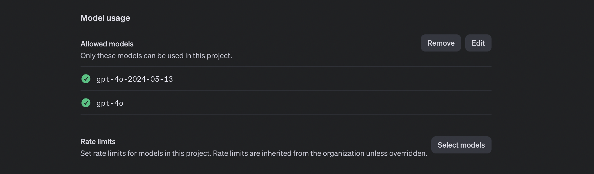

# Recipe Nutrition Analysis Using Wolfram and AI


In this tutorial, you will learn how to analyze recipe nutrition using Wolfram Cloud and OpenAI on the Node.js platform. The recipe and the report analysis will be saved to the GridDB database.

## Table of Contents

1. [Introduction](#introduction)
2. [Running the Project](#running-the-project)
3. [Getting Started](#getting-started)
    1. [Setting Up Wolfram Cloud Account](#setting-up-wolfram-cloud-account)
    2. [Installing Node.js](#installing-nodejs)
    3. [Setting Up GridDB](#setting-up-griddb)
    4. [Configuring OpenAI](#configuring-openai)
4. [Project Structure](#project-structure)
5. [Implementation](#implementation)
    1. [Connecting to Wolfram Cloud](#connecting-to-wolfram-cloud)
    2. [Retrieving Recipe Data](#retrieving-recipe-data)
    3. [Analyzing Nutrition Data](#analyzing-nutrition-data)
    4. [Storing Data in GridDB](#storing-data-in-griddb)
6. [Conclusion](#conclusion)

## Introduction

This tutorial will walk you through building a nutrition analysis tool for recipes using Wolfram Cloud and OpenAI. We will use Node.js for the backend and store the resulting data in GridDB.

## Running the Project

Clone the project from this [GitHub](https://github.com/junwatu/recipe-nutritional-analysis.git) repository.

```shell
git clone https://github.com/junwatu/recipe-nutritional-analysis.git
```

Change the directory to the project root and go to the `app` folder then install all the dependencies:

```shell
cd recipe-nutritional-analysis
cd app
npm install
```

Create the `.env` file and copy environment variables from the `.env.example`. You need an [OpenAI API](#configuring-openai) key for this project, please go here for explanation.

## Getting Started

To build this project, you need the following steps:

### 1. Setting Up Wolfram Cloud Account

[Sign up](https://www.wolframcloud.com) for the Wolfram Cloud account. You will need Wolfram to calculate recipe nutrition using the [NutritionReport](https://resources.wolframcloud.com/FunctionRepository/resources/NutritionReport) function.

### 2. Installing Node.js

This project will run on the Node.js platform. You need to install it from [here](https://nodejs.org/en/download). For this project, we will use the `nvm` package manager and Node.js v16.20.2
LTS version.

```shell
# installs nvm (Node Version Manager)
curl -o- https://raw.githubusercontent.com/nvm-sh/nvm/v0.39.7/install.sh | bash

# download and install Node.js
nvm install 16

# verifies the right Node.js version is in the environment
node -v # should print `v16.20.2`

# verifies the right NPM version is in the environment
npm -v # should print `8.19.4``
```

To connect Node.js and GridDB database, you need the [gridb-node-api](https://github.com/nodejs/node-addon-api) npm package which is a Node.js binding developed using GridDB C Client and Node addon API.

### 3. Setting Up GridDB

We will use the GridDB database to save recipes and it's nutrition analysis. Please look at the [guide](https://docs.griddb.net/latest/gettingstarted/using-apt/#install-with-apt-get) for detailed installation. We will use Ubuntu 20.04 LTS here.

Run GridDB and check if the service is running. Use this command:

```shell
sudo systemctl status gridstore
```

If not running try to run the database with this command:

```shell
sudo systemctl start gridstore
```

### 4. Configuring OpenAI

To access any OpenAI services, you need a valid key. Go to this [link](https://platform.openai.com/api-keys) and create a new OpenAI key.


The OpenAI key is on a project basis, so we need to create a project first in the OpenAI platform and you need also to enable any models that you use on a project. For this project, we will need `gpt-4o` model.



The OpenAI key will be saved on the `.env` file and make sure not to include it in version control by adding it to the `.gitignore`.

## Project Structure

Outline the directory and file structure for the project:

```shell
recipe-nutrition-analysis/
├── images/
│   └── cover.jpg
├── src/
│   ├── index.js
│   ├── wolframClient.js
│   ├── openaiClient.js
│   ├── gridDBClient.js
│   └── utils.js
├── .env
├── package.json
└── README.md
```

## Implementation

### Connecting to Wolfram Cloud

Explain how to establish a connection to Wolfram Cloud using the API key.

### Retrieving Recipe Data

Provide instructions and code snippets to fetch recipe data.

### Analyzing Nutrition Data

Show how to use Wolfram and OpenAI to analyze the nutrition data from the recipe.

Create a function to calculate recipe nutrition using Wolfram Language in the Wolfram Cloud editor.

```wolfram
api = APIFunction[
  {"ingredients" -> "String"},
  ResourceFunction["NutritionReport"][#ingredients, "ASCIITable"] &]
```

### Storing Data in GridDB

Detail the steps and code to save the analyzed data into GridDB.

## Conclusion

Summarize the tutorial and discuss potential improvements or next steps for the project.

---

This structure ensures that each critical aspect of the tutorial is covered in a logical and easy-to-follow manner.
